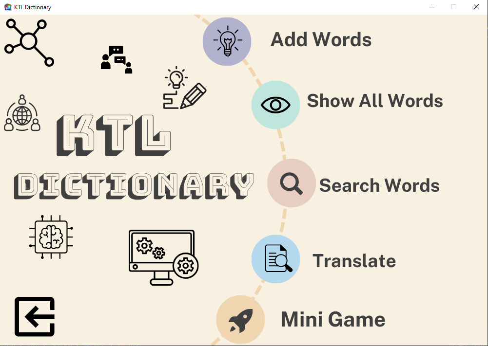

# Introduction
This is a project about our OOP course-build a Dictionary with Java. Our group's application provides some basic functions in a dictionary such as Word Lookup, Add Words, Text Translation, Some Games to Practice and English - Vietnamese dictionary support.

# Demo
- ![Image Demo] (src/main/resources/Image/Demo.png)
- 
- ![Video Demo] (https://drive.google.com/file/d/1POa-NZz3QaXg-zs0jHB93U9pOlpDM3R8/view);
# Getting Started 
**Note**: Make sure you have completed [JAVA basic Tutorial](https://www.w3schools.com/java/) and [Object-Oriented Programming](https://www.w3schools.com/java/java_oop.asp) or you are in the process of learning Java

## Step 1: Install and set up JavaFx Module
- First of all, a javaFx module and Scene Builder is needed to support about building the interface of our application.
**Installing JavaFx** : Install _Javafx_ at [Gluon](https://gluonhq.com/products/javafx/) and follow the [instruction](https://openjfx.io/openjfx-docs/) in order to run the first programming.
- If you have already installed this module in your devices, Skip this step.

## Step 2: Run this program
- Clone this project in our repository. 
- Open Project in IDEA.
- Import the file database mySQL (edict.sql) to your database and change the name of database and password of yours.
- Import the voice RSS jar to the module of the project (src/data/voicerss_tts_java).
- Find the class name App.java in package Screen (src/main/java/Screen/App.java) to run the application. 
- If you want change data, you can change in file database or V_E.txt or E_V.txt file.

# This Application
**Uses**:
- LookUp: Look up the definition of words in both Vietnamese and English words in Search Words
- Pronunciation of Words: Support reading words in each functions of the application.
- Translate: Translate long text, with a function to read the whole sentence or passage. 
- Show all Words.
- Games: Memorize vocabulary. 

**Usage**:

- Select mode: There are some modes in the main interface of the Application, Click to the button that you need to use.
- Add Word: 
  - Click the Add Words button.
  - Type the word that you want to add, then choose the type of word and the definition of this word ,and click Add Words to add word.
  - Choose the word in the list of words that you added, click the sound button in order to pronounce the word. 
  - Click the back button to return the main screen of the dictionary.
- Show All Words:
  - Click the Show All Words button. 
  - All Words in the file are shown, choose the word to show its definition, click the sound button in order to pronounce the word.
  - Click the swap button to switch between the interface displaying English and Vietnamese words.
  - Click the back button to return the main screen of the dictionary.
- Search Word:
  - Click the Search Word button.
  - Click to the Search Bar and type the word that you need to look up.
  - Click the sound button in order to pronounce the word.
  - Click the swap button to switch between the interface displaying English and Vietnamese words.
  - Click the back button to return the main screen of the dictionary.
- Translate: 
  - Click the Translate button.
  - Type the sentence or long text that you need to translate in the left TextArea.
  - The Translation will be shown in the right textArea.
  - Click the sound button in order to read the whole sentence in the text area.
  - Click the swap button to switch between the interface translating from E to V or V to E.
  - Click the back button to return the main screen of the dictionary.
- Game: 
  - There are two games: Game Quiz and HangMan
    - Game Quiz: 
      - Click to Start button to Start the Game with 10 question for each turn.
      - Choose the answer for each question, click submit to check. 
         - For each correct answer, you get 10 points.
         - For wrong answer, you cannot get any point for the question.
    - HangMan:
      - Click the start Button to start the Game.
      - You have to guess the word with some hints and 6 chances to guess the letter that the answer involved.
      - You win if you can guess the correct answer before using all the 6 chances.
      - If not, you lose. 

**Resources**:
- JavaFx and Scene Builder.
- Free Vietnamese Dictionary Database. 
- Google Translate API.
- Voice RSS API.
- V_E and E_V file data.

# Developer
- Duong Minh Kien [duongkienabc] (https://github.com/duongkienabc):
  - Version CommandLine Develop
  - UI Develop
  - TTS API
  - Google Translate API
  - Collect data and Connect to database
  - BackEnd Develop
  - UX Develop
- Hung Minh Tuan [8MTi] (https://github.com/8MTi):
  - Version CommandLine Develop
  - FrontEnd Develop
  - BackEnd Develop
  - UI Design
  - UX Develop
- Nguyen Duc Long [NgDucLong] (https://github.com/NgDucLong): 
  - Version CommandLine Develop
  - Game Application Design
  - Game Application Develop
  - FrontEnd Develop
  - UI Develop
  - UX Develop

# Contributing
- Pull requests are welcome. For major changes, please open an issue first to discuss what you would like to change.
# Troubleshooting
- **Error : JavaFX runtime components are missing, and are required to run this application**

  - You need add VM Options for Main class to run program. Please follow the instruction at [Getting Started with Javafx.](https://openjfx.io/openjfx-docs/)

- **Or you can  see the [Troubleshooting](https://docs.oracle.com/javafx/2/deployment/troubleshooting.htm) page.**

# Learn more
To learn more about Java and Javafx, take a look at the following resources:
-  [Java Tutorial](https://www.w3schools.com/java/) - From **basic to advanced** java
- [Set up with Java](https://www.geeksforgeeks.org/setting-environment-java/) - how set up **Java environment** on your devices.
-  [Javafx Tutorial](https://www.javatpoint.com/javafx-tutorial) - a **guided tour** of the Javafx basics.

# Project status
The project is completed.
# Note 
The application is written for educational purposes.